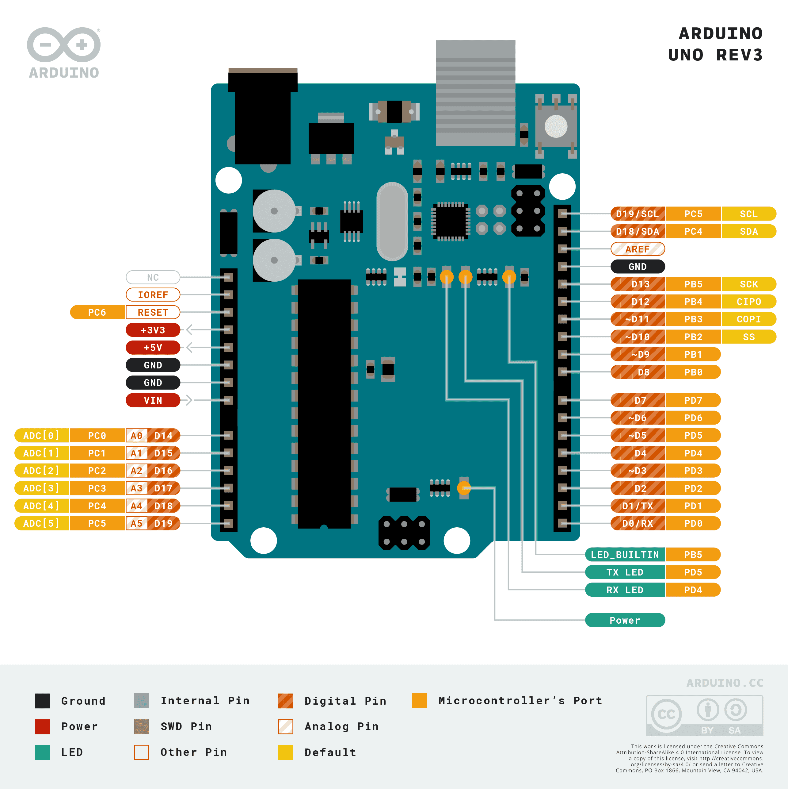

# Blinking-LED--Arduino

> **Objective:** create a simple blinking LED with a one second delay. 

## Output 

## Components Used
1. Arduino Uno
2. Breadboard
3. LED
4. Resistor (330 Ohm )
5. 3 x Jumper Wires

|   |       Name       | Quantity |
| - | ---------------- | :------- |
| 1 | Arduino Uno      |    1     |
| 2 | Breadboard       |    1     |
| 3 | LED              |    1     |
| 4 | 330 Ohm Resisotr |    1     |
| 5 | Jumber Wire      |    3     | 

## Connections
1. Connect a wire into `GND` on the Arduino board
  
    A. Connect the other end of that wire into the `GND` (negative voltage rail) of a breadboard
2. Connect a new wire into `Power`(positive voltage rail) of the breadboard

    A.  Connect the other end of that wire into the `Cathode` (negative) of **LED** on the breadboard

3.  Connect `Anode` (positive) pin of **LED** to a  **330 Ohm resistor**

4. Connect the other end of **resistor** inot pin 13 of the Arduino UNO board

## Components and Layouts

## Reference 
[Breadboard image](https://courses.grainger.illinois.edu/ece110/sp2022/content/labs/Experiments/BB_HowTo.pdf) I used